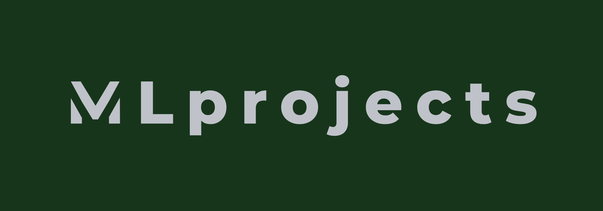

<div align="center">

 <br />

# Machine Learning Projects


[Overview](#scroll-overview)
•
[Projects](#chart_with_upwards_trend-model)
</div>

## :bookmark_tabs: Menu

- [Overview](#scroll-overview)
- [Model](#chart_with_upwards_trend-model)
- [Requirements](#exclamation-requirements)
- [Folder Structure](#open_file_folder-folder-structure)
- [Author](#smiley_cat-author)

## :scroll: Overview

This repository hosts some of my personal machine learning projects. I decided to document projects in which I compared different models and preprocessing techniques, while predicting something fun / getting new insights from data. I have recently started and added my first two projects on text clustering and movie recommendations. In the future more projects will be added. Every project has their own README explaining the project in more detail.


## :chart_with_upwards_trend: Projects

- [x] [Text clustering using News Headlines](https://github.com/bryanlusse/ml-projects/tree/master/text-clustering)
- [x] [Movie recommendation](https://github.com/bryanlusse/ml-projects/tree/master/movie-recommendation)
- [ ] Text classification using News Headlines
- [ ] Housing price predictions


## :open_file_folder: Folder Structure

```
.
├── text-clustering                     
├── movie-recommendation                
├── assets                              # Logo
└── README.md
```

## :smiley_cat: Author

- [@bryanlusse](https://github.com/bryanlusse)

Made with &nbsp;❤️&nbsp;